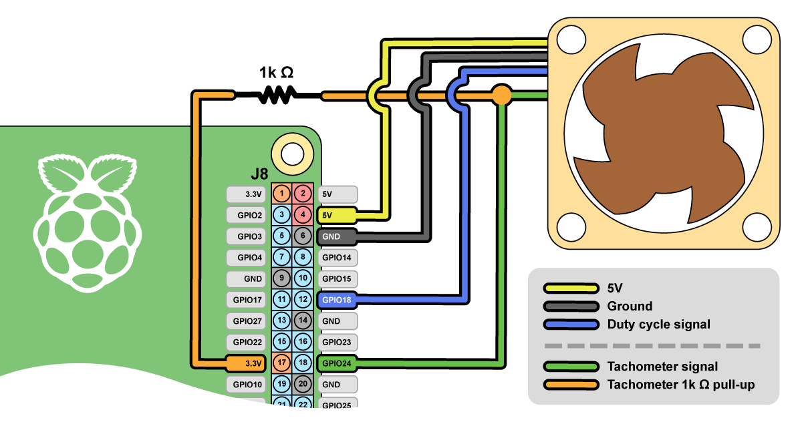
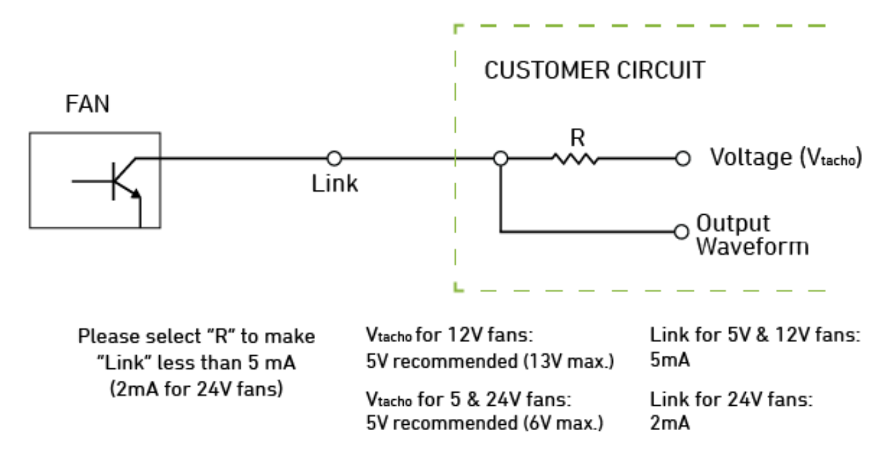

# Raspberry Pi PWM Fan Control in C

* **SUPPORTED!** - Current/legacy, x32/x64 Raspberry Pi OS support, on Raspberry Pi models 3-5.
* **CPU-efficient** - C binary with 0% CPU utilization.
* **Non-stepwise** - Avoids constant on/off cycling of fan by using different on/off temps, grace periods, and bezier easing.
* **Configurable** - Uses environment variables for overriding default configuration.
* **systemd Service** - Setup as a persistent systemd service, persistent on reboots.

---

## ⚠ Major April 2024 Updates ⚠

**This program expects a FULLY up-to-date Raspberry Pi OS (either current and legacy) and firmware**

```bash
# Ensure OS up-to-date:
sudo apt update -y && sudo apt upgrade -y

# Ensure up-to-date firmware:
# - RUN AT YOUR OWN RISK!
# - Needed to get consistent `sysfs` inteface between all models
# - Needed to address https://forums.raspberrypi.com/viewtopic.php?t=367294#p2205138
sudo rpi-update
```

#### April 2024 Release Notes:

* **Debugging support has been updated** and is now controlled via CLI argument.
* **Tachometer support has been updated** and is now controlled via CLI argument.
* **Environment variables have been updated** specifically `PWM_FAN_FAN_OFF_GRACE_S` and `PWM_FAN_SLEEP_S` are now `PWM_FAN_FAN_OFF_GRACE_MS` and `PWM_FAN_SLEEP_MS`; tachometer environment variables have been removed
* **WiringPi has been removed** - This was [breaking builds](https://github.com/folkhack/raspberry-pi-pwm-fan-2/issues/3#issue-2080669409) on the newer Raspbian OS after Gordon outright decided to abandon the project. There also has been [no movement](https://github.com/GrazerComputerClub/WiringPi/issues/21) for Raspberry Pi 5 support for months. WiringPi will not be considered moving forward.
* **It was not replaced with another library** - gpiod doesn't have PWM support, pigpio is inefficient with the CPU and lacks RPi support - there is **no** fully supported GPIO + hardware PWM C library that exists right now. I am also incredibly disappointed with how fast these libraries have fallen out of support, with their efficiency, and with the features they are lacking.
* **`sysfs` is now our PWM and GPIO control surface** - This was the _only_ way to get PWM support for all Raspberry Pi OS versions, for all modern Pi's 3-5. Despite any discussions about its deprecation, sysfs is not going away anytime soon. Its integration into the Linux kernel and its importance in existing applications and systems ensure its longevity. Do you want your fans to work consistently for all modern Pi's, with their OS variants? This is your only feasible option.

---

## Wiring:

* Default configuration is for a 5V Noctua PWM fan, but other PWM fans should support the same wiring
    - [NF-A4x10 5V PWM](https://noctua.at/en/nf-a4x10-5v-pwm) - Noctua 40x10mm fan
    - [NF-A4x20 5V PWM](https://noctua.at/en/nf-a4x20-5v-pwm) - Noctua 40x20mm fan
* "Pin #" are the board pin numbers; as-in "pin 1 starts at J8" numbers
* "GPIO #" are the BCM GPIO numbers used for software configuration via environment variables
* "Duty cycle signal" must be on a PWM capable GPIO pin:
    - GPIO18 - default
    - GPIO19 - PWM1
    - GPIO12 - PWM0
    - GPIO13 - PWM1

|Pin #|GPIO #|Name|Color|Notes|
|---|---|---|---|---|
|4||**5V**|Yellow||
|6||**Ground**|Black||
|12|18|**Duty cycle signal**|Blue|PWM channel #0|
|18|24|**Tachometer signal**|Green|(optional) Any GPIO pin should work|
|17||**Tachometer pull-up**|Orange|(optional) bridge to "tachometer signal" with a 1k Ω resistor; this is an additional wire, not from the fan|

#### Simplified Wiring Diagram:



#### Noctua Wiring Diagram:



*From [Noctua General PWM Fan Whitepaper](https://noctua.at/pub/media/wysiwyg/Noctua_PWM_specifications_white_paper.pdf)*

---

## PWM dtoverlay Configuration:

Base configuration is `dtoverlay=pwm,pin=18,func=2` in `/boot/config.txt` (or `/boot/firmware/config.txt`):

```bash
# Add `dtoverlay=pwm,pin=18,func=2` devicetree overlay in boot configuration and restart:
# - NOTE: Configuratio may be at /boot/config.txt depending on OS version!
sudo nano /boot/firmware/config.txt
sudo shutdown -r now
```

#### PWN dtoverlay Notes:

* All dtoverlay configurations in the below link have been tested successfully
* Function 2/4, and alt0/alt5 configured channels work

See [Enabling Hardware PWM on Raspberry Pi](https://github.com/dotnet/iot/blob/main/Documentation/raspi-pwm.md) for more information (differnt pins, 2 channel support, etc.).

---

## Scripted `install.sh` Install:

**IMPORTANT!:** The service is not started by default - you are expected to configure the GPIO pin, duty cycle hertz, and misc. configuration options to your fan spec + usecase. **[See: Environment Variables Config &raquo;](#environment-variables)**

```bash
# From the Raspberry Pi (builds for installed OS variant)
sudo install.sh

# Display help and exit:
sudo pwm_fan_control2 --help

# Running with defaults:
# - IMPORTANT! Only for Noctua 5V PWM fans!
sudo pwm_fan_control2

# Running with debug logging enabled (meant for CLI):
sudo pwm_fan_control2 debug

# Running with debug logging + tachometer enabled:
#    sudo pwm_fan_control2 debug {gpio_tach_pin} {tachometer_pulse_per_rotation}
sudo pwm_fan_control2 debug 24 2

# For testing other fans configurations override environment variables by CLI with sudo:
#   export PWM_FAN_SLEEP_MS=60000 && \
#   export PWM_FAN_MIN_DUTY_CYCLE=20 && \
#   sudo -E bash -c './pwm_fan_control2'

# Configure the service:
# - May want to add environment variables to override configuration defaults
# - Not required for Noctua 5V PWM fans
sudo nano /etc/systemd/system/pwm_fan_control2.service
sudo systemctl daemon-reload

# Start the service:
sudo service pwm_fan_control2 start

# Enable service at boot:
sudo systemctl enable pwm_fan_control2.service

# Misc control:
#   sudo service pwm_fan_control2 status
#   sudo service pwm_fan_control2 stop
#   sudo service pwm_fan_control2 restart

# Uninstall - stops and removes installed system service + binary:
#   sudo make uninstall
```

---

## Manual Build and Install:

**Requirements:** Git and basic build tooling.

```bash
# Install build tooling
sudo apt install git build-essential

# Get this project
git clone https://github.com/folkhack/raspberry-pi-pwm-fan-2.git
cd raspberry-pi-pwm-fan

# Build project (builds for installed OS variant)
# - Project binary builds in project root ./pwm_fan_control2
make compile

# Install binary
# - Installs to /usr/sbin/pwm_fan_control2
# - `sudo make uninstall` to stop service and remove binary
sudo make install
```

---

## Running as a systemd Service:

After installation you can edit the service file:

```bash
# Edit system service:
sudo nano /etc/systemd/system/pwm_fan_control2.service

# Reload systemd and restart service:
sudo systemctl daemon-reload
sudo service pwm_fan_control2 restart

# Enable service at boot:
sudo systemctl enable pwm_fan_control2.service
```

#### Example systemd configuration:

**NOTE:** This is a good spot to load in an environment configuration as seen below with the commented out line.

```ini
[Unit]
Description=PWM fan speed control
After=sysinit.target

[Service]
# Environment=PWM_FAN_SLEEP_MS=60000
ExecStart=/usr/sbin/pwm_fan_control2
Type=simple
User=root
Group=root
Restart=always

[Install]
WantedBy=multi-user.target
```

### Environment Varibale Reference:

**NOTE:** These environment variables are fully supported by *both* the Python 3 POC and the formal C implementation!

|Variable|Default|Type|Notes|
|---|---|---|---|
|**`PWM_FAN_BCM_GPIO_PIN_PWM`**|18|unsigned short|BCM GPIO pin for PWM duty cycle signal|
|**`PWM_FAN_PWM_FREQ_HZ`**|2500|unsigned short|PWM duty cycle target freqency Hz - from Noctua Spec at 25kHz|
|**`PWM_FAN_MIN_DUTY_CYCLE`**|20|unsigned short|Minimum PWM duty cycle - from Noctua spec at 20%|
|**`PWM_FAN_MAX_DUTY_CYCLE`**|100|unsigned short|Maximum PWM duty cycle|
|**`PWM_FAN_MIN_OFF_TEMP_C`**|38|float|Turn fan off if is on and CPU temp falls below this value|
|**`PWM_FAN_MIN_ON_TEMP_C`**|40|float|Turn fan on if is off and CPU temp rises above this value|
|**`PWM_FAN_MAX_TEMP_C`**|46|float|Set fan duty cycle to `PWM_FAN_MAX_DUTY_CYCLE` if CPU temp rises above this value|
|**`PWM_FAN_FAN_OFF_GRACE_MS`**|60000|unsigned short|Turn fan off if CPU temp stays below `MIN_OFF_TEMP_C` this for time period|
|**`PWM_FAN_SLEEP_MS`**|250|unsigned short|Main loop check CPU and set PWM duty cycle delay|

---

## Notes:

#### Why C over Python:

When running the Python POC at full 25khz PWM frequency (Noctua Spec) CPU consumption can be upwards of 5-10%. With C it's at 0% on a Raspberry 4.

#### Easing Function:

A quartic bezier easing function was used to smooth fan speed at the upper/lower boundries of the configured temps `PWM_FAN_MIN_OFF_TEMP_C` and `PWM_FAN_MAX_TEMP_C`. At temps closer to the lower boundry, the fan speed is kept close to the `PWM_FAN_MIN_DUTY_CYCLE`, and at the higher boundry fan speed will stay closer to `PWM_FAN_MAX_DUTY_CYCLE`.

* Raspberry Pi PWM Fan Linear & Quartic Bezier Fan Easing Graphed:
https://docs.google.com/spreadsheets/d/135dJXuy5qX0IenmxIjSwHkgeXwgmW6yCtiCEznN_yzk
* Quartic bezier ease-in/out function
https://easings.net/#easeInOutQuart
* Desmos quartic bezier function graphed
https://www.desmos.com/calculator/d5f3jhma63
* Raspberry PI PWM Fan Test CSV Graphed:
https://docs.google.com/spreadsheets/d/1FNpywV0M-U6qUqJ1sFyiU5g77cSyhXuzXnMXVCM04ls

#### Links:

* Noctua A4X20 5V PWM Fan Spec:
https://noctua.at/en/nf-a4x20-pwm/specification
* Noctua General PWM Fan Spec:
https://noctua.at/pub/media/wysiwyg/Noctua_PWM_specifications_white_paper.pdf
